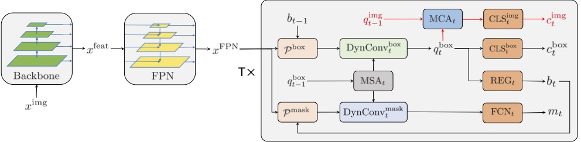

# Query2: Query over Queries for Improving Gastrointestinal Stromal Tumour Detection in Endoscopic Ultrasound 

More code will be released soon. I'm happy to provide full dataset and answer any [Issues](https://github.com/howardchina/query2/issues) about this work. Please let me know if you need any help.

download: [GIST514-DB](https://drive.google.com/drive/folders/1TG9Bq-OaKkMXV2s42f_oZJdoTOfIAZLi?usp=sharing)

Detail evaluation on each splits refers to 'work_dirs/queryglob_usdanno514roi_B_2_7_split\<n\>/test_log_queryglob_usdanno514roi_B_2_7_split\<n\>_sor.txt'

|      | Split_0 |      | Split_1 |      | Split_2 |      | Split_3 |      | Split_4 |      |  Total |
|:----:|:-------:|:----:|:-------:|:----:|:-------:|:----:|:-------:|:----:|:-------:|:----:|:------:|
|      |   LMYM  | GIST |   LMYM  | GIST |   LMYM  | GIST |   LMYM  | GIST |   LMYM  | GIST |        |
|  T  |    45   |  48  |    49   |  52  |    48   |  54  |    51   |  43  |    48   |  51  |   489  |
|  F  |    7    |   6  |    2    |   0  |    1    |   0  |    0    |   9  |    0    |   0  |   25   |
| MISS |    0    |   0  |    0    |   0  |    0    |   0  |    0    |   0  |    0    |   0  |    0   |
|  Acc |  87.74% |      |  98.06% |      |  99.03% |      |  91.26% |      | 100.00% |      | 95.14% |
|  Sen |  88.89% |      | 100.00% |      | 100.00% |      |  82.69% |      | 100.00% |      | 94.30% |
|  Spe |  86.54% |      |  96.08% |      |  97.96% |      | 100.00% |      | 100.00% |      | 96.02% |

training and test log: 'work_dirs'

ps:
- In file 'mmdet/datasets/anatomy.py', '_eval_global()' denotes the inference with SOR, while '_eval_vanilla' denotes inference without SOR.
- Code files for query^2 is located at 'mmdet/models/detectors/queryglob.py'. (and don't be confused if you see 'mmdet/models/detectors/query2.py', this is the other model we have tried but not publised)
